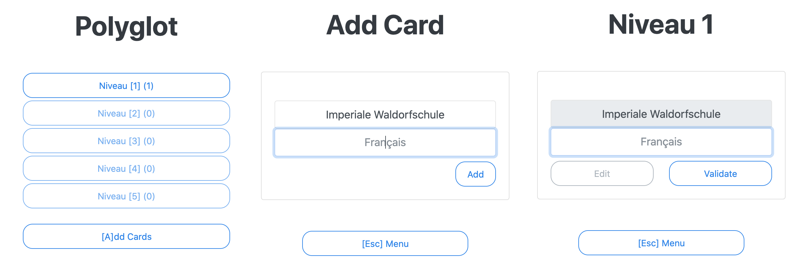

# Polyglot

A browser based vocabulary trainer.



## About

*Polyglot* is a full stack web application that provides an easy-to-use vocabulary trainer.

 * Reponsice Web-Interface (Javascript / Bootstrap)
 * Spring-Boot REST-API
 * mySQL data persistence

## Tutorial

Check out the [tutorial page](documentation/tutorial.md) for instruction on how to use the webapp!

## Tech Specs

More details on the [Polyglot internals here](documentation/API.md)!

## Deployment

There are two ways to get Polyglot running: Docker based setup and native setup.

 * [Docker](#docker) is easier to install, but required more resources. Database and Webservice are deployed as individual containers.
 * Native setup integrates into an existing mysql and tomcat installation and therefore consumes fewer resources.

Either way, first step is to clone this repository:  
```bash
git clone https://github.com/kartoffelquadrat/Polyglot.git
cd Polyglot
```

### Docker

 * Build and deploy the containters:  
```bash
docker-compose up
```

 * Access the [web-frontend](http://127.0.0.1:8444).

### Native

 * Prepare your existing mySQL database. Use below commands or the provided [script](polyglot-manual-setup.sql):  
```mysql -u root -p```  
```sql
USE mysql;
CREATE USER 'polyglot'@'localhost' IDENTIFIED BY 'loh8eeTooj0i';
CREATE DATABASE polyglot;
GRANT ALL PRIVILEGES ON polyglot.* TO 'polyglot'@'localhost';
```

 * Build the Polyglot war file:  
```mvn clean package```

 * Deploy ```target/polyglot.war``` to your application server.

 * Access the [web-frontend](http://127.0.0.1:8444).

## Contact / Pull Requests

 * Author: Maximilian Schiedermeier 
 * Github: Kartoffelquadrat
 * Webpage: https://www.cs.mcgill.ca/~mschie3
 * [License](LICENSE): [MIT](https://opensource.org/licenses/MIT)
