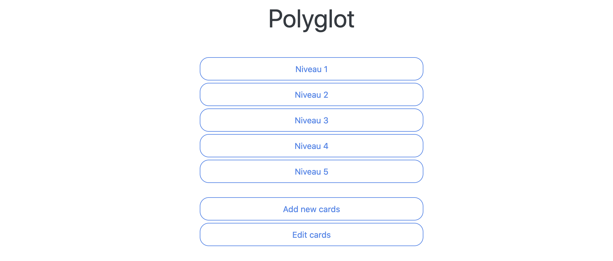

# Polyglot

A browser based vocabulary trainer.

## About

*Polyglot* is a full stack web application.

 * Data persistence in a mySQL database, hosted in a docker container.
 * Server side logic as a Spring-Boot REST backend.
 * User interface as responsive Javascript / Bootstrap webapp.

## Layers

Details for the various layers:

### SQL

Polyglot stipulates the existence of a database ```polyglot```. Create it with:  
```CREATE DATABASE polyglot;```

The table reflects the class ```Card.java```, having the following columns:

 * PK generated id
 * French
 * German
 * Box

So ultimately, the **generated** layout will look like this:

```SQL
mysql> SELECT * FROM card;
+----+-------------+-----------+-----+
| id | french      | german    | box |
+----+-------------+-----------+-----+
|  1 | L'amour (f) | Die Liebe |   0 |
+----+-------------+-----------+-----+
1 row in set (0.00 sec)
```

### REST

RIF tree:


### JS

 * Landing page
   * Select Box, (fill status per box ?)
   * Edit Card
   * Add Card
 * Test page
   * Show A-Side
   * Enter details for B-Side
   * Show result, proceed
   * Back to landing
 * Edit page
   * Search for card, by content
   * Update / Delete card (Id known) (save & reload)
   * Back to landing
 * Add a new card
   * Enter A-Side
   * Enter B-Side
   * Done (save & reload)
   * Back to landing

Illustration of landing page:


