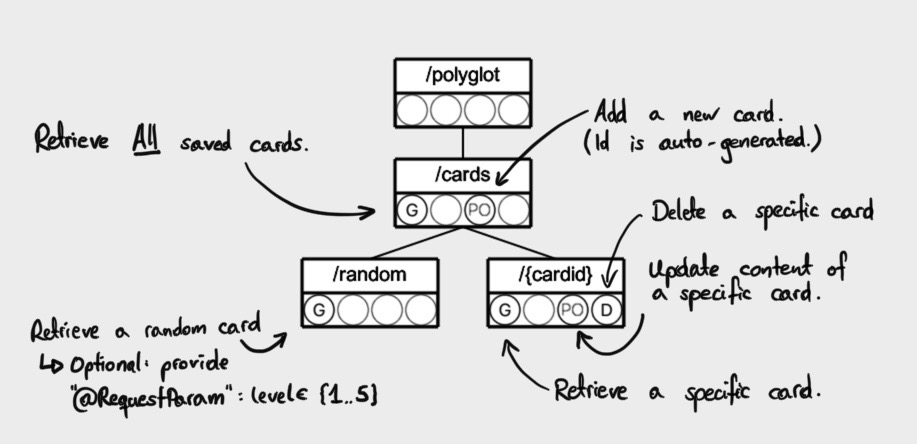

# Polyglot

A browser based vocabulary trainer.

## About

*Polyglot* is a full stack web application.

 * Data persistence in a mySQL database, hosted in a docker container.
 * Server side logic as a Spring-Boot REST backend, hosted in a docker container.
 * User interface as responsive Javascript / Bootstrap webapp.

## Layers

Details for the various application layers:

### Web Front-End


The frontend consists of the following pages and functionality:

 * Landing page
   * 5 buttons to select the desired difficulty (implicitly shows current fill state)
   * Add-Card button, to feed new cards to the system
 * Add a new card page
   * Card form with two lines
     * Statement in native language (revealed)
     * Statement in foreign language (concealed)
   * Submit button
   * Button to go back to Landing page
 * Training page
   * Card form with two lines
     * Statement in native language (revealed)
     * Statement in foreign language (concealed)
   * Option to reveal solution
   * Option to verify a submitted solution
   * Button to go back to Landing page


### REST-API

The REST resources are arranged as indicated in the RIF model below. Some resources support optional parameters.



 > Note: ```/api``` is common prequel to all REST calls, for clear distinction to web-ui URIs.

#### Import / Export

As docuemnted above, the API supports import and export of the database via REST calls. The body paylod is in both cases a JSON file.

 * [Sample import / export JSON file](documentation/ie-sample.json)
 * [General JSON schema for import / export JSON files](documentation/ie-schema.json).

### Database

The actual vocabulary is persisted in a mySQL database. There is only one table: ```polycglot.card```. Every line represents a vocabulary card with two language entries, an id and a box. The latter represents the cards positioning in a vocabulary box with 5 spaces.

Sample:  
```SQL
mysql> SELECT * FROM card;
+----+-----+----------------------------+-------------------------+
| id | box | french                     | german                  |
+----+-----+----------------------------+-------------------------+
|  1 |   3 | niaiser                    | herumblödeln            |
|  2 |   3 | biscuit (m)                | Keks (m)                |
|  3 |   2 | sans gluten                | glutenfrei              |
|  4 |   0 | torchon (m)                | Küchentuch (n)          |
|  5 |   1 | école de fôret imperiale   | imperiale waldorfschule |
|  6 |   0 | bac à sable (m)            | Sandkasten (m)          |
|  7 |   0 | abri antiatomique (m)      | Atomschutzbunker (m)    |
|  8 |   0 | nid d'oiseau (m)           | Vogelnest (n)           |
|  9 |   0 | étoile (f)                 | Stern (m)               |
| 10 |   0 | cocasse                    | drollig                 |
| 11 |   0 | pomme (f)                  | Apfel (m)               |
| 12 |   0 | subtil équilibre (m)       | Balanceakt (m)          |
| 13 |   0 | brique (f)                 | Ziegelstein (m)         |
| 14 |   0 | Raton laveur (m)           | Waschbär (m)            |
| 15 |   0 | Colibri (m)                | Kolibri (m)             |
| 16 |   0 | Pétale de rose (m)         | Rosenblatt (m)          |
| 17 |   2 | impasse (f)                | sackgasse (f)           |
+----+-----+----------------------------+-------------------------+
```
## Deployment

 * Clone this repo:  
```bash
git clone https://kartoffelquadrat.eu:5050/maex/Polyglot.git
cd Polyglot
```

### Composed deployment

 * Deploy the application with docker compose:  
```bash
docker-compose up
```

 * Open a browser, [access the web-client](http://localhost:8444/polyglot)

### Individual deployment

 * Build and deploy only the DB:  
```bash
	docker build -t polyglot-db . -f Dockerfile-db
docker run --name polyglot-db -p 3333:3306 polyglot-db
```

 * Update the connection settings in ```application.properties```:  
```properties
spring.datasource.url=jdbc:mysql://${MYSQL_HOST:localhost}:3333/polyglot
```

 * Run the REST back-end:  
```bash
mvn spring-boot:run
```

## Contact / Pull Requests

 * Author: Maximilian Schiedermeier 
 * Github: Kartoffelquadrat
 * Webpage: https://www.cs.mcgill.ca/~mschie3
 * License: [MIT](https://opensource.org/licenses/MIT)
